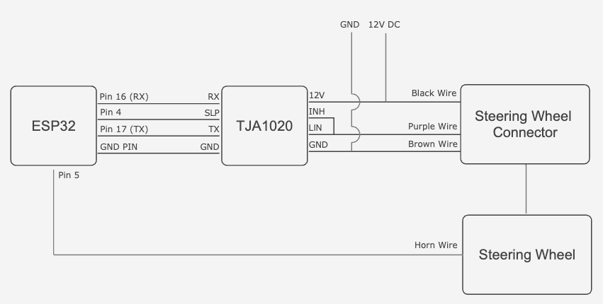

# 🎮 Volante Volkswagen como Gamepad 🎮

[English](./README.md) | Português

Este projeto permite transformar um volante Volkswagen com comunicação LIN em um gamepad, ideal para jogos de corrida de PC ou outras aplicações. Por meio de engenharia reversa do protocolo LIN do volante, ele permite ler os botões pressionados e transmiti-los como eventos de gamepad por meio de Bluetooth Low Energy (BLE). Além disso, ele permite o controle total da iluminação dos botões, para que você possa usar todas as funções do volante.

**Observação:**  O foco aqui é usar os botões do volante como dispositivo de entrada.  Ângulo de direção e force feedback não são abordados, já que  essas funções geralmente ficam por conta da base do volante em simuladores de corrida.

O projeto também pode servir como base para adaptar volantes incompatíveis de outros veículos, abrindo caminho para soluções personalizadas e expandindo a compatibilidade.

## Recursos

*   **Integração com o Volante**
    *   Lê os estados dos botões de volantes Volkswagen com comunicação LIN, incluindo modelos da VW, Audi, Skoda e Seat com plataformas PQ24/PQ25 (testado com um volante VW Up!, mas a compatibilidade com outros modelos é provável).
    *   Permite usar o botão da buzina para ações no jogo.
*   **Capacidades Bluetooth**
    *   Transmite os botões pressionados sem fio como um gamepad Bluetooth padrão, compatível com PCs e outros dispositivos com Bluetooth.
    *   Utiliza Bluetooth Low Energy (BLE) para economizar energia.
*   **Controle da Luz de Fundo**
    *   Oferece 128 níveis de controle de brilho para a luz de fundo dos botões do volante.
*   **Componentes Reutilizáveis**
    *   Design modular com componentes bem definidos, facilitando a integração com outros projetos e a customização.

## Como Funciona

O projeto usa o barramento LIN, uma rede de comunicação presente em veículos, para ler os botões pressionados no volante. O microcontrolador ESP32 atua como o nó mestre no barramento LIN, solicitando e recebendo dados do volante (o nó escravo).

1.  **Botão Pressionado:** Quando você pressiona um botão no volante, o módulo do volante envia um pacote de dados pelo barramento LIN.
2.  **ESP32 Lê os Dados:** O ESP32, conectado ao barramento LIN por meio do transceptor LIN, recebe e decodifica este pacote de dados.
3.  **Transmissão BLE:** O ESP32 traduz o botão pressionado em um evento de gamepad padrão e o transmite via Bluetooth.
4.  **Ação no Jogo:** O dispositivo receptor (por exemplo, um PC) reconhece o evento do gamepad e aciona a ação correspondente no jogo ou aplicativo.

## Peças Utilizadas

| Peça                       | Descrição                                                                          | Número da Peça |
|----------------------------|--------------------------------------------------------------------------------------|----------------|
| Conector do Volante         | Conector de 5 pinos para o volante (apenas 3 pinos são usados neste projeto)          | 8E0 973 605    |
| Volante                     | Volante VW Up! com botões e sem paddle shifts                                       | 6EA 419 091 H   |
| Comandos do Volante         | O módulo eletrônico dentro do volante que lida com os botões pressionados          | 18D 959 442    |
| Transceptor LIN            | TJA1020, TJA1021 ou SIT1021T  ([Usei esse do AliExpress](https://pt.aliexpress.com/item/1005006348508612.html))                                                       | -               |
| ESP32                      | Qualquer placa de desenvolvimento ESP32                                              | -               |

## Diagrama de Fiação
Lembre-se que esse diagrama é baseado na minha configuração. A fiação pode mudar dependendo do modelo do volante ou da placa controladora que você usar.

## Protocolo LIN

O volante se comunica usando frames LIN. Aqui está uma análise dos frames relevantes, obtidos por meio de engenharia reversa:

| ID do Frame | Tipo             | Descrição                           | Tamanho | Byte 0                                            | Byte 1                                      | Byte 5                                                  |
|-------------|------------------|---------------------------------------|---------|-------------------------------------------------|----------------------------------------------|---------------------------------------------------------|
| 0x0D        | Master Request  | Definir nível de luz de fundo          | 2       | 0x0 - 0x7F - Nível de brilho                  | 0xFF - Habilita/desabilita respostas de estado do botão | -                                                       |
| 0x0E        | Slave Response | Estados dos botões                     | 8       | Aumenta a cada resposta                        | Botão pressionado (veja a tabela de mapeamento abaixo) | Indica por quanto tempo o botão foi pressionado          |
| 0x0C        | Slave Response | Desconhecido (possivelmente dados de diagnóstico) | 4       | Aumenta a cada resposta                        | -                                               | -                                                       |
| 0x3A        | Slave Response | Desconhecido (possivelmente dados de diagnóstico) | 2       | Aumenta a cada resposta                        | -                                               | -                                                       |

**Mapeamento de Botões**

(TODO)

| ID   | Botão           |
|------|------------------|
| 0x02 | -                |
| 0x03 | -                |
| 0x06 | -                |
| 0x07 | -                |
| 0x09 | -                |
| 0x0A | -                |
| 0x1A | -                |
| 0x22 | Cima             |
| 0x23 | Baixo            |
| 0x28 | -                |
| 0x2A | -                |
| 0x2B | -                |
